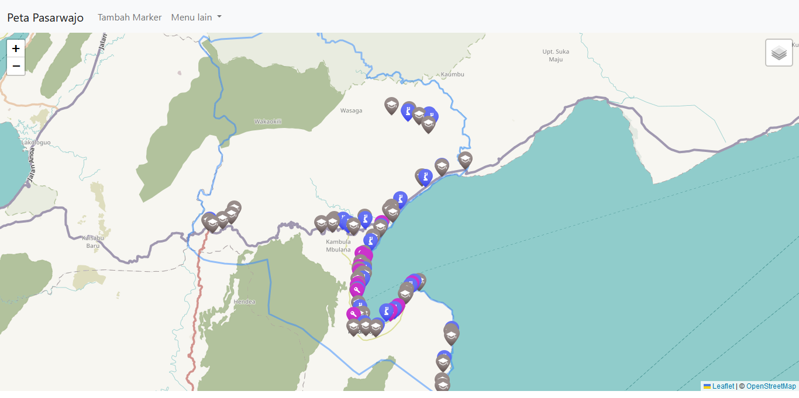

# leaflet.js-peta



## Deskripsi Projek
Projek ini adalah aplikasi peta berbasis web yang menggunakan Leaflet.js untuk menampilkan informasi geografis. Aplikasi ini memungkinkan pengguna untuk menambahkan, mengedit, dan menghapus marker di peta.

## Konfigurasi Projek:

### Requirements:
- XAMPP

### Langkah-langkah Instalasi
1. **Clone Repository**
```sh
   git clone https://github.com/GloryPower6/leaflet.js-peta.git
```
2. **Buat Database**
Buat database dengan nama `db_leaflet_kec_pasarwajo` di MySQL.

3. **Pindahkan File**
Tambahkan file-file dari repository ini ke dalam `htdocs/peta-pasarwajo/` atau bisa disesuikan dengan mengganti variabel APP_ROOT_FOLDER yang ada di dalam file `config.php`.

### Konfigurasi
1. **Konfigurasi Database**
    - Buka file `data/connection.php` dan sesuaikan pengaturan.
    - Import database `db_leaflet_kec_pasarwajo.sql` menggunakan phpMyAdmin atau command line:
```sh
mysql -u username -p db_leaflet_kec_pasarwajo < path/to/db_leaflet_kec_pasarwajo.sql
```

### Penggunaan
1. Buka browser dan akses `http://localhost/peta-pasarwajo` untuk melihat aplikasi berjalan.

Nasir Azis Jaelani E1E121006 
##
#### GloryPower6